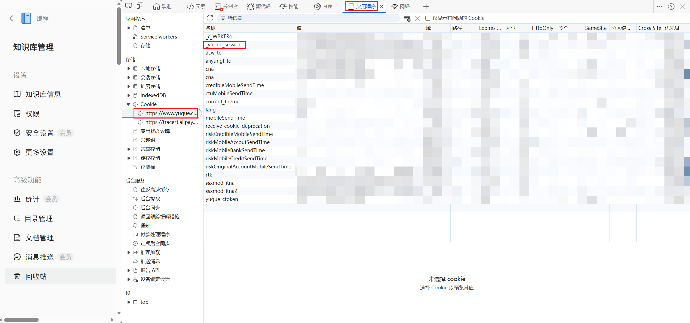

# 语雀文档下载工具

下载语雀文档，按知识库目录结构保存为本地 markdown 文件。支持 **命令行** 和 **Web 图形界面** 两种使用方式。

## 环境要求

- Node.js >= 14

## 安装

```bash
git clone https://github.com/RemiliaNyaa/yuque2md.git
cd yuque2md
npm install
```

或者直接下载 `yuque_download.js`，手动安装 axios：

```bash
npm install axios
```

## 使用方法

### 方式一：Web 图形界面（推荐）

```bash
npm run start:web
```

浏览器会自动打开 `http://localhost:3456`，在网页中填写 Token、选择模式、点击下载即可。下载日志实时显示，无需记忆命令行参数。

### 方式二：命令行

```bash
node yuque_download.js [模式] -t <token> [选项]
```

三种模式由 URL 格式自动判断：

| 模式 | 命令 | 说明 |
|---|---|---|
| 全部知识库 | `--all -t <token>` | 下载账号下所有知识库 |
| 单知识库 | `<知识库URL> -t <token>` | 下载整个知识库 |
| 单文档 | `<文档URL> -t <token> [--sub]` | 下载单篇文档（可选子文档） |

### 选项

| 参数 | 说明 |
|---|---|
| `-t, --token <token>` | 语雀 cookie token（必填，也可设置环境变量 `YUQUE_TOKEN`） |
| `-s, --sub` | 单文档模式: 同时下载所有子文档 |
| `-o, --output <dir>` | 输出目录（默认: `./yuque_output`） |
| `-r, --download-resources` | 下载文档中的静态资源到本地（默认保持远程链接） |
| `--all` | 下载全部知识库 |
| `-h, --help` | 显示帮助 |

### 示例

```bash
# 下载全部知识库
node yuque_download.js --all -t "你的token"

# 下载全部知识库，并将静态资源保存到本地
node yuque_download.js --all -t "你的token" -r

# 下载整个知识库
node yuque_download.js "https://www.yuque.com/xxx/kb-slug" -t "你的token"

# 只下载单篇文档
node yuque_download.js "https://www.yuque.com/xxx/kb/doc-slug" -t "你的token"

# 下载文档及其所有子文档，并将静态资源保存到本地
node yuque_download.js "https://www.yuque.com/xxx/kb/doc-slug" -t "你的token" --sub -r

# 指定输出目录
node yuque_download.js "https://www.yuque.com/xxx/kb-slug" -t "你的token" -o "./my_docs"
```

## 获取 token

打开语雀网页 → F12 → Application → Cookies → 找到 `_yuque_session`，复制它的值。



> ⚠️ token 是你个人登录凭证，请勿泄露给他人。

## 特性

- 支持公开和私有知识库（私有需 token）
- 支持单篇下载或递归下载子树
- 按知识库原始目录结构保存文件
- 已下载的文件自动跳过（断点续传）
- 零配置，单文件即可运行
- 支持下载文档中的静态资源到本地（`-r` 参数）
- 自动处理同名文档/分组冲突（url/uuid 后缀去重）

### 静态资源下载

使用 `-r` 或 `--download-resources` 参数可将文档中引用的所有静态资源下载到本地：

- **支持类型**: 图片（png、jpg、jpeg、gif、webp、svg、bmp，来源 `cdn.nlark.com`）+ 附件（所有格式，来源 `yuque.com/attachments`）
- **文件组织**: 每级目录下统一使用 `resources/` 根文件夹，按文档名分子目录存放所有资源文件
- **链接替换**: 文档中的远程链接自动替换为 `./resources/{文档名}/` 相对路径

> 📌 不加 `-r` 参数时，所有资源链接保持语雀云端链接形式。

### 同名文档/分组处理

语雀允许同目录下存在同名文档或分组（内部通过 uuid 区分）。本工具自动检测并处理冲突：
- **同名文档**: 文件名添加 `_url` 后缀（如 `资源文档_sglmlwqxwn5atqrp.md`）
- **同名分组**: 文件夹名添加 `_uuid` 后缀（如 `分组_zCk9b7u0/`）

## License

MIT
