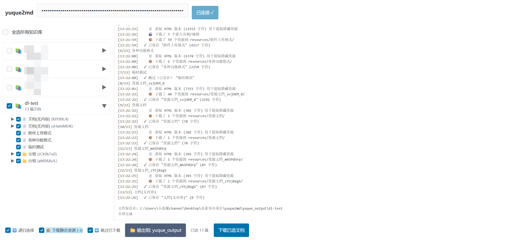

# 语雀文档下载工具

下载语雀文档，按知识库目录结构保存为本地 markdown 文件。支持 **命令行** 和 **Web 图形界面** 两种使用方式。

## 环境要求

- Node.js >= 14

## 安装

```bash
git clone https://github.com/RemiliaNyaa/yuque2md.git
cd yuque2md
npm install
```

> **Windows 用户可直接双击 `一键启动服务(网页端).bat`**：首次运行自动安装依赖（使用淘宝镜像防墙），之后直接启动服务并自动打开浏览器访问 `http://localhost:3456`。

## 使用方法

### 方式一：Web 图形界面（推荐）

```bash
npm run start:web
```

浏览器访问 `http://localhost:3456`。

**新版 GUI 特性：**
- 🔑 **仅需 Token**：无需手动输入 URL，自动列出所有知识库
- 🌲 **文档树浏览**：点击知识库旁的 ▶ 展开，层层浏览文档结构
- ☐ **知识库全选**：勾选知识库卡片左侧复选框即可选中该知识库全部文档（无需展开）
- ☑ **自由勾选**：展开后可单独勾选任意文档
- 🔄 **递归选择**：默认开启，勾选分组时自动勾选其下所有子文档
- 📦 **下载静态资源**：可选将图片、附件、嵌入音频视频下载到本地
- 📁 **自定义输出目录**：点击「输出到」按钮选择本地文件夹
- ⏭ **跳过已下载**：默认开启，断点续传不重复下载已有文件
- 📟 **实时日志**：右侧面板显示下载进度



> 点击知识库旁的 ▶ 按钮即可加载文档树，勾选需要的文档后点击「下载已选文档」。

### 方式二：命令行

```bash
node yuque_download.js [模式] -t <token> [选项]
```

三种模式由 URL 格式自动判断：

| 模式 | 命令 | 说明 |
|---|---|---|
| 全部知识库 | `--all -t <token>` | 下载账号下所有知识库 |
| 单知识库 | `<知识库URL> -t <token>` | 下载整个知识库 |
| 单文档 | `<文档URL> -t <token> [--sub]` | 下载单篇文档（可选子文档） |

### 选项

| 参数 | 说明 |
|---|---|
| `-t, --token <token>` | 语雀 cookie token（必填，也可设置环境变量 `YUQUE_TOKEN`） |
| `-s, --sub` | 单文档模式: 同时下载所有子文档 |
| `-o, --output <dir>` | 输出目录（默认: `./yuque_output`） |
| `-r, --download-resources` | 下载文档中的静态资源到本地（默认保持远程链接） |
| `-f, --force` | 强制重新下载，不跳过已存在的文档 |
| `--all` | 下载全部知识库 |
| `-h, --help` | 显示帮助 |

> **默认行为**: 断点续传模式，自动跳过已下载完成的文档。如需强制全部重新下载，添加 `-f` / `--force` 参数。
> 
> **⚠ 注意**: 如果切换了 `-r` 开关（从下载资源切到不下载，或反过来），建议使用 `-f` 强制重下，因为已下载的文档不会自动更新为带资源/不带资源的版本。

### 示例

```bash
# 下载全部知识库
node yuque_download.js --all -t "你的token"

# 下载全部知识库，并将静态资源保存到本地
node yuque_download.js --all -t "你的token" -r

# 下载整个知识库
node yuque_download.js "https://www.yuque.com/xxx/kb-slug" -t "你的token"

# 只下载单篇文档
node yuque_download.js "https://www.yuque.com/xxx/kb/doc-slug" -t "你的token"

# 下载文档及其所有子文档，并将静态资源保存到本地
node yuque_download.js "https://www.yuque.com/xxx/kb/doc-slug" -t "你的token" --sub -r

# 强制重新下载（不跳过已存在文档）
node yuque_download.js "https://www.yuque.com/xxx/kb-slug" -t "你的token" -f

# 指定输出目录
node yuque_download.js "https://www.yuque.com/xxx/kb-slug" -t "你的token" -o "./my_docs"
```

## 获取 token

打开语雀网页 → F12 → Application → Cookies → 找到 `_yuque_session`，复制它的值。


> ⚠️ token 是你个人登录凭证，请勿泄露给他人。

## 特性

- 支持公开和私有知识库（私有需 token）
- 支持单篇下载或递归下载子树
- 按知识库原始目录结构保存文件
- 已下载的文件自动跳过（断点续传）
- 零配置，单文件即可运行
- 支持下载文档中的静态资源到本地（`-r` 参数）
- 自动处理同名文档/分组冲突（uuid 后缀去重）

### 静态资源下载

使用 `-r` 或 `--download-resources` 参数可将文档中引用的所有静态资源下载到本地：

**可下载到本地：**

| 资源类型 | 来源 | 说明 |
|---------|------|------|
| 图片 (png/jpg/gif/webp/svg/bmp) | `cdn.nlark.com` | 已有规则自动下载 |
| 附件 (所有格式) | `attachments/` | 已有规则自动下载 |
| 嵌入本地文件 (Office/PDF/Sketch等) | `attachments/` | 同附件格式 |
| 嵌入音频 (mp3/wav/m4a) | HTML `data-audio-src` → `attachments/` | 自动提取并替换卡片链接 |
| 嵌入视频 (mp4/mov/avi等) | HTML `data-video-src` → `attachments/` | 自动提取并替换卡片链接 |
| 公式 (LaTeX) | `cdn.nlark.com/yuque/__latex/xxx.svg` | 自动下载 SVG 并替换原 `$...$` 代码为图片 |
| UML 图 / 文本绘图 | `cdn.nlark.com/yuque/__puml/xxx.svg` | 已有 SVG 规则自动下载 |
| 画板 / 思维导图 | 导出为图片 | 已有图片规则自动下载 |

**无静态资源可下载（交互式组件，仅保留链接）：**

| 类型 | 原因 |
|------|------|
| 数据表 / 画册 / 看板 | 浏览器渲染的交互组件，无静态文件 |
| 投票 / 打卡 | 同上 |
| 加密文本 | 需密码，API 不返回内容 |
| 日历 | 语雀导出格式损坏 |
| 流程图 | 语雀导出直接空白 |

**无需特殊处理：** 表格、代码块、折叠块、第三方嵌入（B站/优酷等）

- **文件组织**: 每级目录下统一使用 `resources/` 根文件夹，按文档名分子目录存放所有资源文件
- **链接替换**: 文档中的远程链接自动替换为 `./resources/{文档名}/` 相对路径

> 📌 不加 `-r` 参数时，所有资源链接保持语雀云端链接形式。

### 文档类型支持

语雀共有 6 种文档类型，本工具的支持情况如下：

| 语雀类型 | 图标 | 导出格式 | 状态 | 说明 |
|---------|:--:|---------|:--:|------|
| 文档 | 📄 | `.md` | ✅ | API 原生 markdown 导出 |
| 表格 | 📄 | `.xlsx` | ✅ | 解析 lakesheet 格式 → Excel |
| 数据表 | 📄 | `.json` | ⚠️ | API 不返回记录行数据，保存表结构 JSON |
| 画板 | 📄 | `.json` | ⚠️ | 保存 lakeboard 绘图数据 JSON |
| 分组 | 📁 | 文件夹 | ✅ | 按目录结构创建文件夹 |
| 链接 | 🔗 | `.txt` | ✅ | TOC 直接提供链接地址 |

> **表格 (.xlsx)**：自行解压语雀私有的 lakesheet 压缩格式，转换为标准 Excel 文件，保留合并单元格等结构。
> 
> **数据表 / 画板**：待语雀导出 API 研究完成后，将支持直接下载语雀官方生成的 xlsx/png 文件。

### 同名文档/分组处理

语雀允许同目录下存在同名文档或分组（内部通过 uuid 区分）。本工具自动检测并处理冲突，对于同名文档或分组，统一使用 `_uuid` 后 8 位作为后缀：

- **同名文档**: `资源文档_svjUKM_8.md`
- **同名分组**: `分组_zCk9b7u0/`

## License

MIT
