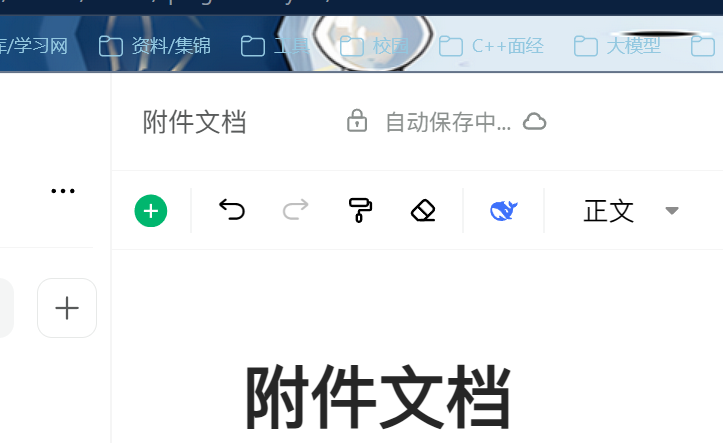
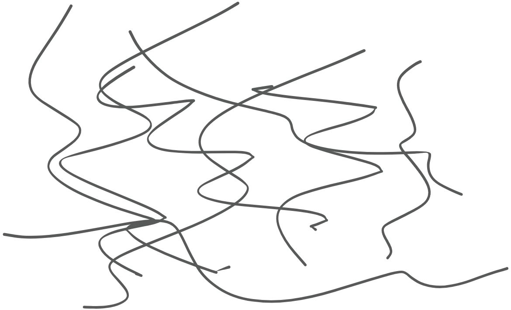
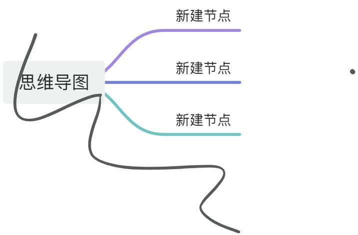
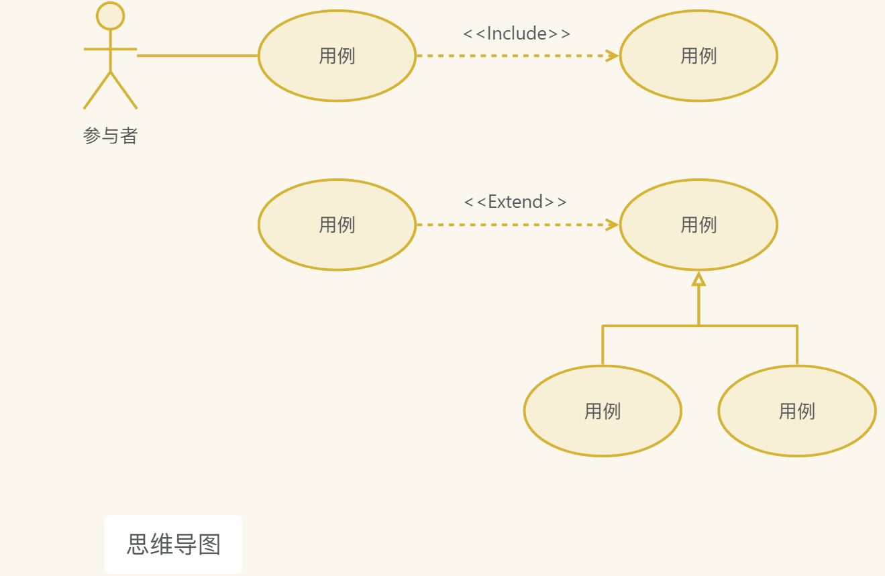
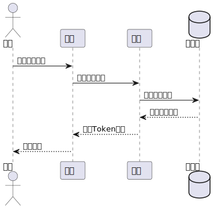
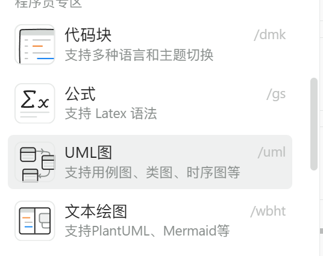

# 各种功能格式

# 截图


# 表格
| 111 | sad 撒 | |
| --- | --- | --- |
| 我的娃 | 是啊大师的 | |
| | |  阿萨德按时 |


# 状态
<font style="background:#F8CED3;color:#70000D">红色</font>

# 画板、思维导图、流程图




# 数据表、画册、看板
[此处为语雀卡片，点击链接查看](https://www.yuque.com/simixue/nevsdv/qzkrga2db3izysoc#tBVQX)

[此处为语雀卡片，点击链接查看](https://www.yuque.com/simixue/nevsdv/qzkrga2db3izysoc#nApFx)

[此处为语雀卡片，点击链接查看](https://www.yuque.com/simixue/nevsdv/qzkrga2db3izysoc#epo7c)

# 代码块、公式、UML 图、文本绘图
```markdown
啊啊啊啊啊啊啊啊啊啊啊啊啊啊
    啊啊啊啊啊
```

$ \nabla^2 u = \frac{\partial^2 u}{\partial x^2}
+ \frac{\partial^2 u}{\partial y^2}
+ \frac{\partial^2 u}{\partial z^2} = 0 $





# 折叠块、图册
<details class="lake-collapse"><summary id="u54fac6bd"><span class="ne-text">撒啊</span></summary><p id="u5cb3e7ed" class="ne-p"><span class="ne-text">撒啊</span></p><p id="u1ffb2d31" class="ne-p"><span class="ne-text">撒啊</span></p><p id="ub4500fdc" class="ne-p"><span class="ne-text">撒啊</span></p><p id="ub3a077bb" class="ne-p"><span class="ne-text">撒啊</span></p></details>
  

# 提及、语雀内容、日历、日期、投票、打卡、加密文本
[附件文档](https://www.yuque.com/simixue/nevsdv/qzkrga2db3izysoc)

[其他培训机构项目链接](https://www.yuque.com/simixue/du4lg4/yhb8kz6ofzksdvhi)

[20260602~20260602]   
[20260618~20260618] 按时按时  
[20260623~20260623] undefined  

06月29日

[此处为语雀卡片，点击链接查看](https://www.yuque.com/simixue/nevsdv/qzkrga2db3izysoc#mRMqr)

[此处为语雀卡片，点击链接查看](https://www.yuque.com/simixue/nevsdv/qzkrga2db3izysoc#H2SQR)

[此处为语雀卡片，点击链接查看](https://www.yuque.com/simixue/nevsdv/qzkrga2db3izysoc#ZUxT9)

# 第三方
[youku](https://player.youku.com/embed/XNDc1NDU1MTQwOA==)

[bilibili](https://player.bilibili.com/player.html?aid=55895675&autoplay=0)

[amap](https://ditu.amap.com/)

[juejin](https://code.juejin.cn/pen/7111233570496053255?embed=true)

[codepen](https://codepen.io/afc163-1472555193/embed/oNXqWGP)

